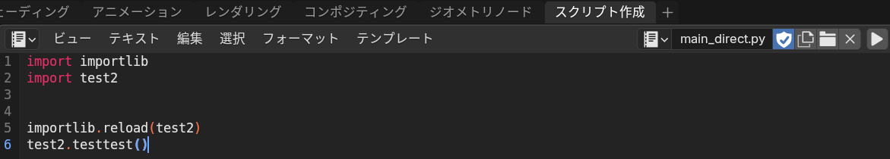

# blenderのスクリプトをあれしてこれするやつ

## いんすと
uv, blender, これ

## うさげ
1. launch_blender.batを起動する。
   中身としてはadd_path.pyでプロジェクトのパスを通してblenderを起動している
   エラーが出たらblenderのパスが通ってることを確認してもろてって感じで
2. blenderの"スクリプト生成"タブに移動し、startup_snippet.pyを読み込む
   
   blenderのファイルタブ -> デフォルト -> 起動ファイルの保存をやっておくと楽
3. main.pyでモジュールを呼び出して動作させたりする
   

## めも
```python
import importlib
from modules import test2
importlib.reload(test2)

def main():
    test2.testtest()
```
とすると、testtest関数の変更を保存したやつが反映される。

今できるのは環境構築だけです。
またこんど！